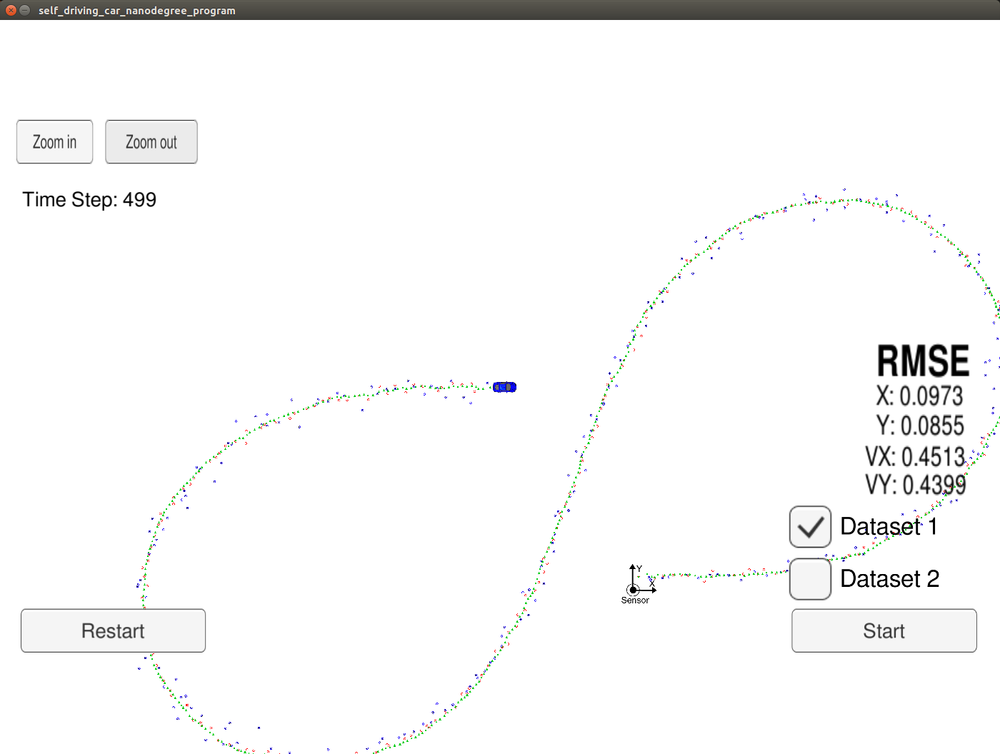
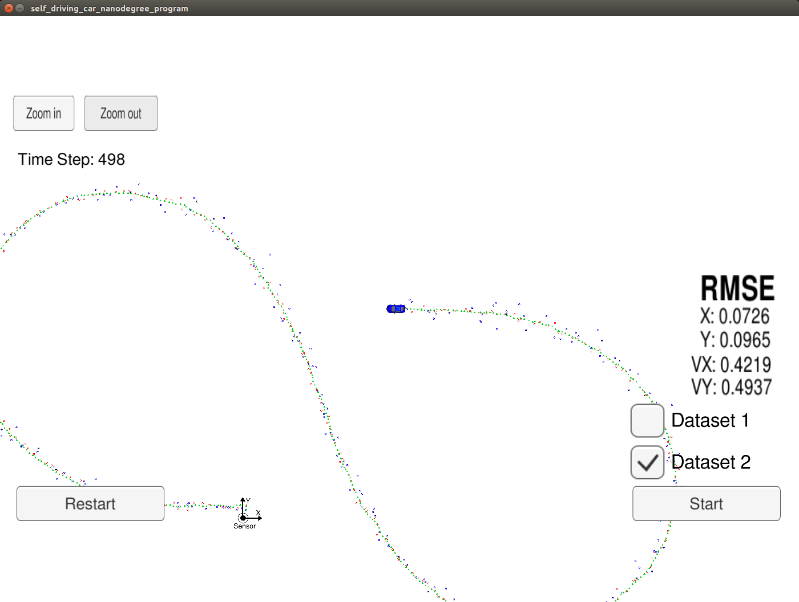

# Selfdriving car Nanodegree - Term2
## Project 1: Extended Kalman Filter

In this project, an Extended Kalman Filter (EKF) for sensor fusion is implemented in C++. The starter code was forked from the udacity repository: https://github.com/udacity/CarND-Extended-Kalman-Filter-Project

The algorithm written here is able to estimate of the position and speed of a vehicle from noisy sensor measurements. In this particular project, a LIDAR and Radar data are simulated. The data of both sensors is combined using sensor fusion, also implemented into the EKF algorithm. The algorithm was tested with the Udacity simulator, which can be found [here](https://github.com/udacity/self-driving-car-sim/releases). For running compiling and running the code, [uWebSocketIO](https://github.com/uWebSockets/uWebSockets) is also necessary.

For running the code in Linux, you just  need the following instructions in the command  line:

1. mkdir build
2. cd build
3. cmake ..
4. make
5. ./ExtendedKF

## Results of the simulation
The simulations using the  udacity simulator can be found below. The RMSE values are below the asked values.

## Improvements and optimizations
Some changes were made over the initial code provided by Udacity.
The principal change was implementing a separated initialization sequence, outside the EKF algorithm. In this way, the initialization flag check is no longer necessary, which can improve the performance.

The improved version is on the improved_ver branch of this git repository.
